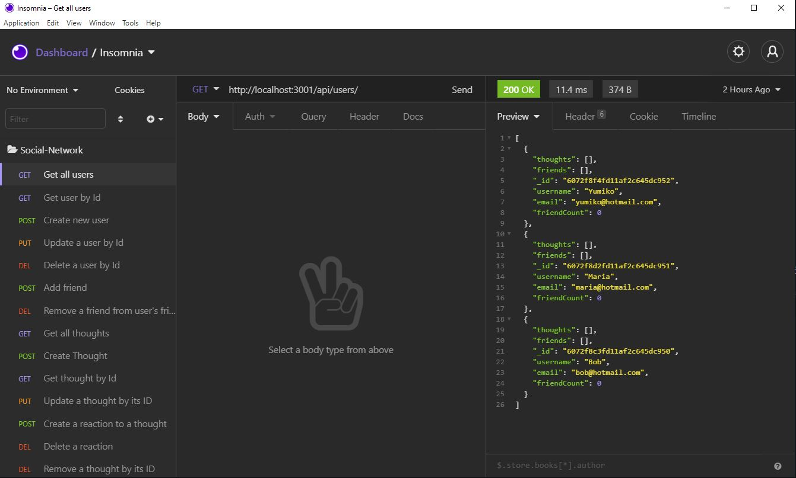

# Social Network API

## Description

This project provides backend logic for a social networking site, built on MongoDB, Express and Node.js 

## Screenshot

## Table of Contents 

* [Installation](#installation)
* [Usage](#usage)
* [Video Walkthrough](#video-walkthrough)

## Installation

To install simply download or clone the repository, set up MongoDB on your local computer, navigate to the directory and run `npm install`. 

## Usage

To use the site, run npm start from the directory then connect to the server using a user provided frontend or an api testing tool such as insomnia core. Refer to the various routes files for information on the api.

## Video Walkthrough
 
You can view a video walkthrough of the api functionality here: https://drive.google.com/file/d/1i3zbqwCRVZJcspZ_F0wTqc_yvYAE78Ur/view

## Questions

For additional information on this project contact me by email at shawnevans.music@gmail.com or visit my GitHub page at https://github.com/bluesatyr.